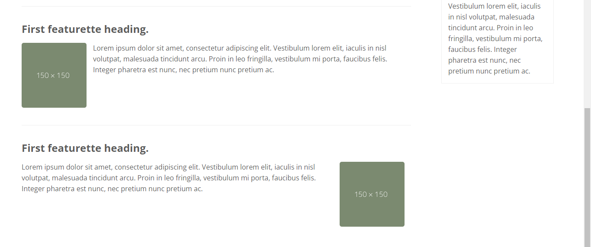

## Lab4Web

**Nama  : Fery Affandi**<br>
**NIM   : 312010018**<br>
**Kelas : TI.20.A.1**<br>

## Praktikum 4


<p align="center">Gambar 4.1

## langkah-langkah praktikum 

Buka text editor yang anda punya, contohnya Visual Studio Code


<p align="center">Gambar 4.2

Persiapan membuat dokumen HTML dengan nama file <b>lab4_box.html</b> seperti berikut.
```html
    <!DOCTYPE html>
    <html lang="en">
    <head>
        <meta charset="UTF-8">
        <meta http-equiv="X-UA-Compatible" content="IE=edge">
        <meta name="viewport" content="width=, initial-scale=1.0">
        <title>Box Element</title>
    </head>
    <body>
        <header>
            <h1>Box Element</h1>
        </header>
    </body>
    </html>
```
## Membuat Box Element

Kemudian tambahkan kode untuk membuat box element dengan tag div seperti berikut.
```html
    <section>
        <div class="div1">Div 1</div>
        <div class="div2">Div 2</div>
        <div class="div3">Div 3</div>
    </section>
```
## CSS Float Property

Selanjutnya tambahkan deklarasi CSS pada head untuk membuat float element, seperti berikut.
```css
    <style>
        div {
            float:left;
            padding: 10px;
        }
        .div1 {
            background: red;
        }
        .div2 {
            background: yellow;
        }
        .div3 {
            background: green;
        }
    </style>
```
kemudian buka browser dan melihat hasilnya.


<p align="center">Gambar 4.3 Box Element Foat

## Mengatur Clearfix Element

<b>Clearfix</b> digunakan untuk mengatur element setelah float element. 
Property `clear` digunakan untuk mengaturnya.

Tambahkan element div lainnya seteleah div3 seperti berikut.
```html
    <section>
        <div class="div1">Div 1</div>
        <div class="div2">Div 2</div>
        <div class="div3">Div 3</div>
        <div class="div4">Div 4</div>
    </section>
```
Kemudian atur property clear pada CSS, seperti berikut.
```css
    .div4 {
        background-color: blue;
        clear: left;
        float: none;
    }
```
selanjutnya buka browser dan refresh kembali.


<p align="center">Gambar 4.4 Clearfix

Lakukan eksperimen terhadap penggunaan property clear 
dengan nilai lainnya (<i>left, both, right</i>), dan amati perubahannya.

## Membuat Layout Sederhana

Kita akan membuat layout web sederhana seperti gambar berikut.


<p align="center">Gambar 4.5 layout sederhana

Buat folder baru dengan nama <b>lab4_layout</b>, kemudian buatlah file baru 
didalamnya dengan nama <b>home.html</b>, dan file css dengan nama <b>style.css.</b>

```html
<!DOCTYPE html>
<html lang="en">
<head>
    <meta charset="UTF-8">
    <meta http-equiv="X-UA-Compatible" content="IE=edge">
    <meta name="viewport" content="width=device-width, initial-scale=1.0">
    <title>Layout Sederhana</title>
    <link rel="stylesheet" href="style.css" >
</head>
<body>
    <div id="container">
        
    </div>
</body>
</html>
```

Kemudian buat kerangka layout dengan semantics element seperti berikut.


<p align="center">Gambar 4.6 kerangka layout

Kemudian tulis kode berikut.
```html
<header>
    <h1>Layout Sederhana</h1>
</header>
<nav>
    <a href="home.html" class="active">Home</a>
    <a href="artikel.html">Artikel</a>
    <a href="about.html">About</a>
    <a href="kontak.html">Kontak</a>
</nav>
<section id="hero"></section>
<section id="wrapper">
    <section id="main"></section>
    <aside id="sidebar"></aside>
</section>
<footer>
    <p>&copy; 2021 - Universitas Pelita Bangsa</p>
</footer>
```

Kemudian buka browser dan lihat hasilnya.


<p align="center">Gambar 4.7 Tampilan Kerangka Layout.

Kemudian tambahkan kode CSS untuk membuat layoutnya.
```css
/* import google font */
@import
url('https://fonts.googleapis.com/css2?family=Open+Sans:ital,wght@0,300;0,400
;0,600;0,700;0,800;1,300;1,400;1,600;1,700;1,800&display=swap');
@import
url('https://fonts.googleapis.com/css2?family=Open+Sans+Condensed:ital,wght@0
,300;0,700;1,300&display=swap');

/* Reset CSS */
* {
    margin: 0;
    padding: 0;
}
body {
    line-height:1;
    font-size:100%;
    font-family:'Open Sans', sans-serif;
    color:#5a5a5a;
}
#container {
    width: 980px;
    margin: 0 auto;
    box-shadow: 0 0 1em #cccccc;
}

/* header */
header {
    padding: 20px;
}
header h1 {
    margin: 20px 10px;
    color: #b5b5b5;
}
```
Kemudian lihat hasilnya pada browser.


<p align="center">Gambar 4.8 Tampilan Header Layout.

## Membuat Navigasi

Kemudian selanjutnya mengatur navigasi.
```css
/* navigasi */
nav {
    display: block;
    background-color: #1f5faa;
}
nav a {
    padding: 15px 30px;
    display: inline-block;
    color: #ffffff;
    font-size: 14px;
    text-decoration: none;
    font-weight: bold;
}
nav a.active,
nav a:hover {
    background-color: #2b83ea;
}
```
Kemudian lihat hasilnya.


<p align="center">Gambar 4.9 Tampilan Navigasi.

## Membuat Hero Panel.

Selanjutnya membuat hero panel. Tambahkan kode HTML dan CSS seperti berikut.

```html
<section id="hero">
    <h1>Hello World!</h1>
    <p>Lorem ipsum dolor sit amet, consectetur adipiscing elit. Vestibulum lorem
    elit, iaculis innisl volutpat, malesuada tincidunt arcu. Proin in leo fringilla,
    vestibulum mi porta, faucibus felis. Integer pharetra est nunc, nec pretium nunc
    pretium ac.</p>
    <a href="home.html" class="btn btn-large">Learn more &raquo;</a>
</section>
```
```css
/* Hero Panel */
#hero {
background-color: #e4e4e5;
padding: 50px 20px;
margin-bottom: 20px;
}
#hero h1 {
margin-bottom: 20px;
font-size: 35px;
}
#hero p {
margin-bottom: 20px;
font-size: 18px;
line-height: 25px;
}
```

<p align="center">Gambar 4.10 tampilan hero Panel.

## Mengatur Layout Main dan Sidebar

Selanjutnya mengatur main content dan sidebar, tambahkan CSS float.
```css
/* main content */
#wrapper {
margin: 0;
}
#main {
float: left;
width: 640px;
padding: 20px;
}
/* sidebar area */
#sidebar {
float: left;
width: 260px;
padding: 20px;
}
```

## Membuat Sidebar Widget

Kemudian selanjutnya menambahkan element lain dalam sidebar.
```html
<aside id="sidebar">
    <div class="widget-box">
        <h3 class="title">Widget Header</h3>
        <ul>
            <li><a href="#">Widget Link</a></li>
            <li><a href="#">Widget Link</a></li>
            <li><a href="#">Widget Link</a></li>
            <li><a href="#">Widget Link</a></li>
            <li><a href="#">Widget Link</a></li>
        </ul>
        </div>
        <div class="widget-box">
            <h3 class="title">Widget Text</h3>
            <p>Vestibulum lorem elit, iaculis in nisl volutpat, malesuada tincidunt
            arcu. Proin in leo fringilla, vestibulum mi porta, faucibus felis. Integer
            pharetra est nunc, nec pretium nunc pretium ac.</p>
</div>
</aside>
```
kemudian tambahkan CSS.
```css
/* widget */
.widget-box {
    border:1px solid #eee;
    margin-bottom:20px;
}
.widget-box .title {
    padding:10px 16px;
    background-color:#428bca;
    color:#fff;
}
.widget-box ul {
    list-style-type:none;
}
.widget-box li {
    border-bottom:1px solid #eee;
}
.widget-box li a {
    padding:10px 16px;
    color:#333;
    display:block;
    text-decoration:none;
}
.widget-box li:hover a {
    background-color:#eee;
}
.widget-box p {
    padding:15px;
    line-height:25px;
}
```
dan hasil pada browsernya seperti ini.


<p align="center">Gambar 4.11 Tampilan Sidebar Widget.

## Mengatur Footer

Selanjutnya mengatur tampilan footer. Tambahkan CSS untuk footer.
```css
/* footer */
footer {
clear:both;
background-color:#1d1d1d;
padding:20px;
color:#eee;
}
```
hasilnya adalah


<p align="center">Gambar 4.12 Tampilan Footer.

## Menambahkan Elemen lainnya pada Main Content

```css
<section id="main">
    <div class="row">
        <div class="box">
            
            <h3>Heading</h3>
            <p>Donec sed odio dui. Etiam porta sem malesuada magna molliseuismod.</p>
            <a href="#" class="btn btn-default">View detail</a>
        </div>
        <div class="box">
            
            <h3>Heading</h3>
            <p>Donec sed odio dui. Etiam porta sem malesuada magna molliseuismod.</p>
            <a href="#" class="btn btn-default">View detail</a>
        </div>
        <div class="box">
            
            <h3>Heading</h3>
            <p>Donec sed odio dui. Etiam porta sem malesuada magna molliseuismod.</p>
            <a href="#" class="btn btn-default">View detail</a>
        </div>
    </div>
</section>
```

Kemudian tambahkan CSS.

```css
/* box */
.box {
    display:block;
    float:left;
    width:33.333333%;
    box-sizing:border-box;
    -moz-box-sizing:border-box;
    -webkit-box-sizing:border-box;
    padding:0 10px;
    text-align:center;
}
.box h3 {
    margin: 15px 0;
}
.box p {
    line-height: 20px;
    font-size: 14px;
    margin-bottom: 15px;
}
box img {
    border: 0;
    vertical-align: middle;
}
.image-circle {
    border-radius: 50%;
}
.row {
    margin: 0 -10px;
    box-sizing: border-box;
    -moz-box-sizing: border-box;
    -webkit-box-sizing: border-box;
}
.row:after, .row:before,
.entry:after, .entry:before {
    content:'';
    display:table;
}
.row:after,
.entry:after {
    clear:both;
}
```

Lihat hasilnya di browser.


<p align="center">Gambar 4.13 Tampilan Content.

## Menambahkan Content Artikel

Selanjutnya membuat content artikel. Tambahkan HTML berikut pada main content.
```html
<hr class="divider" />
<article class="entry">
    <h2>First featurette heading.</h2>
    
    <p>Lorem ipsum dolor sit amet, consectetur adipiscing elit. Vestibulum lorem
    elit, iaculis in nisl volutpat, malesuada tincidunt arcu. Proin in leo fringilla,
    vestibulum mi porta, faucibus felis. Integer pharetra est nunc, nec pretium nunc
    pretium ac.</p>
</article>
<hr class="divider" />
<article class="entry">
    <h2>First featurette heading.</h2>
    
    <p>Lorem ipsum dolor sit amet, consectetur adipiscing elit. Vestibulum lorem
    elit, iaculis in nisl volutpat, malesuada tincidunt arcu. Proin in leo fringilla,
    vestibulum mi porta, faucibus felis. Integer pharetra est nunc, nec pretium nunc
    pretium ac.</p>
</article>
```

Kemudian tambahkan CSS
```css
.divider {
    border:0;
    border-top:1px solid #eeeeee;
    margin:40px 0;
}
/* entry */
.entry {
    margin: 15px 0;
}
.entry h2 {
    margin-bottom: 20px;
}
.entry p {
    line-height: 25px;
}
.entry img {
    float: left;
    border-radius: 5px;
    margin-right: 15px;
}
.entry .right-img {
    float: right;
}
```

refresh pada browser dan hasilnya seperti ini.


<p align="center">Gambar 4.14 Tampilan Artikel.

